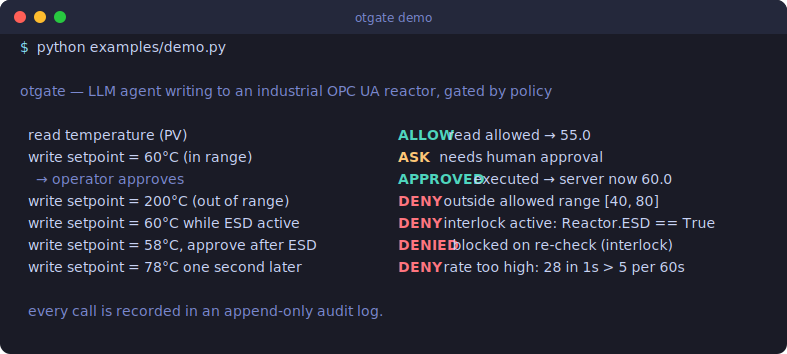

# otgate

[](https://github.com/alikup-ai/otgate/actions/workflows/ci.yml)

An OT-aware authorization gateway that sits between an LLM agent and an industrial OPC UA server, applying a process-aware access policy — value ranges, rate limits, interlocks — to every call the agent makes.

[Русская версия →](README.ru.md)

<p align="center">
  
</p>

```
[MCP client / agent] ---MCP---> [otgate] ---OPC UA---> [OPC UA server]
                                    |
                     [policy engine + audit + shadow mode]
```

otgate is itself an MCP server. The agent connects to it as if it were an ordinary OPC UA MCP; internally otgate holds a client to the real OPC UA server. Every call is transparent to the agent, and otgate intercepts each one to apply policy and record an audit line.

## Why

- Existing OPC UA MCP servers write to tags with **no authorization layer** — the agent has full, unbounded access.
- Existing LLM guardrails (LlamaFirewall, NeMo Guardrails) work on **text/prompts** and do not understand process semantics — they know nothing about ranges, rates of change, or interlocks.
- otgate closes exactly that gap: **OT semantics + admission policy + audit.**

It is not "you may write to this tag" but "you may write *within range X, no faster than Y over interval Z, and only while the emergency tag W is not active*".

## Where this fits: OWASP ASI02

In the [OWASP Top 10 for Agentic Applications](https://genai.owasp.org/), the
risk otgate targets is **ASI02 — Tool Misuse & Exploitation**: an agent that
stays inside its granted privileges but uses a legitimate tool unsafely —
parameter pollution, excessive execution, or a call that is only dangerous given
the current system state.

Identity and access layers (ASI03) answer *may this agent call this tool*. They
do not look at **what** it writes, **how fast**, or **under which conditions**.
otgate is the layer that does:

| ASI02 sub-mechanism | otgate |
| --- | --- |
| Parameter pollution | `value_range` — the argument itself is checked |
| Excessive execution / scale | `max_rate` over `rate_interval`, durable across restarts |
| Unsafe given system state | `interlocks` — reads live guard tags before allowing |
| Unsafe composition (salami attack) | `cumulative_range` — bounds total drift over a window, so slicing a forbidden move into legal steps does not work |
| Recursion / call storms | `max_calls` over `calls_interval` |
| Unverifiable safety condition | fails **closed** — denies rather than guesses |

Per-step limits judge one write; cumulative limits judge a *series*. Without the
latter an agent walks around `max_rate` with many small legal steps:

```
step 1: 50.0 -> 52.5  (drift  +2.5)  ALLOW
step 2: 52.5 -> 55.0  (drift    +5)  ALLOW
step 3: 55.0 -> 57.5  (drift  +7.5)  ALLOW
step 4: 57.5 -> 60.0  (drift   +10)  ALLOW
step 5: 60.0 -> 62.5  (drift +12.5)  DENY  cumulative drift too large:
                                           62.5 is +12.5 from 50, allowed [-10, 10]
```

A full mapping against all ten OWASP agentic risks — including what otgate
explicitly does **not** cover (tool-chain manipulation, goal hijacking, memory
poisoning, rogue-agent detection) — is in
**[docs/threat-model.md](docs/threat-model.md)**.

## Install

```bash
pip install -e .           # core: FakeBackend, engine, MCP server
pip install -e ".[dev]"    # + pytest for the test suite
pip install -e ".[opcua]"  # + asyncua for a real OPC UA backend
```

Python 3.11+.

## Policy example

A policy is a YAML list of per-tag rules. Any tag **not** listed is denied by default.

```yaml
# examples/reactor_policy.yaml
- tag: "ns=2;s=Reactor.TIC101.PV"     # temperature, read-only
  access: read

- tag: "ns=2;s=Reactor.TIC101.SP"     # temperature setpoint
  access: write_with_approval          # writes need human approval (ASK)
  value_range: [40, 80]                # only within 40..80 degC
  cumulative_range: [-10, 10]          # ... and no more than 10 degC total drift
  cumulative_interval: 3600            #     from where it stood an hour ago
  max_rate: 5                          # no faster than 5 degC ...
  rate_interval: 60                    # ... per 60 seconds
  interlocks:
    - tag: "ns=2;s=Reactor.ESD"        # blocked while emergency shutdown ...
      condition: "== true"             # ... is active
      action: deny
```

Access levels: `read`, `write`, `write_with_approval`, `deny`.

Write check order (first failing check wins): tag-in-policy → access → value range → interlocks → rate of change → approval → allow.

## Demo

```bash
python examples/demo.py
```

```
otgate demo — agent interacting with a reactor via the policy gateway
---------------------------------------------------------------------
  read temperature (PV)                            ALLOW read allowed -> 55.0
  write setpoint = 60 degC (in range)              ASK   write requires human approval
  write setpoint = 200 degC (out of range)         DENY  value 200.0 is outside allowed range [40.0, 80.0]
  write setpoint = 60 degC while ESD active        DENY  interlock active: ns=2;s=Reactor.ESD == True (current ns=2;s=Reactor.ESD = True)
  write setpoint = 78 degC one second later        DENY  rate of change too high: |78.0 - 50.0| = 28 in 1s exceeds 5 per 60s

audit log
---------
{"timestamp": "...", "action": "read",  "node_id": "ns=2;s=Reactor.TIC101.PV", "value": null,  "decision": "ALLOW", "reason": "read allowed", "shadow": false, "executed": true}
{"timestamp": "...", "action": "write", "node_id": "ns=2;s=Reactor.TIC101.SP", "value": 60.0,  "decision": "ASK",   "reason": "write requires human approval", "shadow": false, "executed": false}
{"timestamp": "...", "action": "write", "node_id": "ns=2;s=Reactor.TIC101.SP", "value": 200.0, "decision": "DENY",  "reason": "value 200.0 is outside allowed range [40.0, 80.0]", "shadow": false, "executed": false}
{"timestamp": "...", "action": "write", "node_id": "ns=2;s=Reactor.TIC101.SP", "value": 60.0,  "decision": "DENY",  "reason": "interlock active: ns=2;s=Reactor.ESD == True (current ns=2;s=Reactor.ESD = True)", "shadow": false, "executed": false}
{"timestamp": "...", "action": "write", "node_id": "ns=2;s=Reactor.TIC101.SP", "value": 78.0,  "decision": "DENY",  "reason": "rate of change too high: |78.0 - 50.0| = 28 in 1s exceeds 5 per 60s", "shadow": false, "executed": false}
```

## Run as an MCP server

otgate exposes: `read_tag`, `write_tag`, `browse`, `get_audit_log`, and the
operator approval tools `list_pending`, `approve`, `deny`.

```bash
otgate                      # console script (stdio transport)
python -m otgate.server     # equivalent
```

Configuration is via environment variables (so the backend switches without code changes):

| Variable | Default | Meaning |
| --- | --- | --- |
| `OTGATE_BACKEND` | `fake` | `fake` or `asyncua` |
| `OTGATE_POLICY` | `examples/reactor_policy.yaml` | policy YAML path |
| `OTGATE_AUDIT` | `audit.jsonl` | audit log path |
| `OTGATE_SHADOW` | *(off)* | `1`/`true` to enable shadow mode |
| `OTGATE_RATE_HISTORY` | *(in-memory)* | path to a JSONL file to make rate-of-change history **survive restarts** |
| `OTGATE_OPCUA_ENDPOINT` | — | required when backend is `asyncua` |
| `OTGATE_AGENT_TOKEN` | — | bearer token for the single-agent HTTP channel |
| `OTGATE_AGENTS` | — | path to `agents.yaml` for multi-agent mode (overrides single-agent) |
| `OTGATE_OPERATOR_TOKEN` | — | bearer token for the operator HTTP channel (must differ from every agent token) |
| `OTGATE_HOST` / `OTGATE_AGENT_PORT` / `OTGATE_OPERATOR_PORT` | `127.0.0.1` / `8770` / `8771` | HTTP bind host and ports |

Example MCP client config (FakeBackend):

```json
{
  "mcpServers": {
    "otgate": {
      "command": "otgate",
      "env": { "OTGATE_BACKEND": "fake" }
    }
  }
}
```

### Connecting a real OPC UA server

No code changes — install the extra and point the config at your server:

```bash
pip install -e ".[opcua]"
export OTGATE_BACKEND=asyncua
export OTGATE_OPCUA_ENDPOINT=opc.tcp://localhost:4840
otgate
```

The backend lives behind an abstract interface (`otgate/backends/base.py`) with two implementations — `FakeBackend` (in-memory simulator, no dependencies) and `AsyncuaBackend` (real OPC UA). `asyncua` is imported lazily, so the fake backend, the tests and the demo run without it.

## Shadow mode

With `OTGATE_SHADOW=1`, a write that the engine **allows** is **not** executed on the backend — instead the audit records a "WOULD execute" line with `executed: false`. This lets you run an agent and see what it *would* do to the process without any real effect.

## Human approval workflow

A `write_with_approval` tag returns `ASK`. Rather than silently drop the write,
otgate **parks** it as a pending request with a TTL and hands the agent an
approval id. A human then resolves it through the operator tools:

- `list_pending` — show parked write requests.
- `approve <id>` — approve **and** execute, *after re-checking policy* against
  the current process state. If an interlock tripped or the value drifted out of
  range while the request waited, the approval is recorded but the write is
  **blocked** — an approval is intent, never a blind execute.
- `deny <id>` — reject; the write never runs.

Requests that nobody answers within the TTL **expire** (fail-safe: silence means
no). Every step — the ASK, the approval/denial, the eventual execution — is
audited.

> The stdio server exposes all tools in one process (fine for local use). For a
> real deployment, run the **two authenticated HTTP channels** below so the agent
> physically cannot reach `approve`/`deny`.

## Deployment & security

For anything beyond local experimentation, run otgate over HTTP as **two
separate channels**, each behind its own bearer token:

- **agent channel** — `read_tag`, `write_tag`, `browse`
- **operator channel** — `get_audit_log`, `list_pending`, `approve`, `deny`

The agent holds only the agent token, so it cannot even see the approval tools —
isolation is by channel, not by convention.

```bash
export OTGATE_AGENT_TOKEN=$(openssl rand -hex 32)
export OTGATE_OPERATOR_TOKEN=$(openssl rand -hex 32)   # must differ from agent
export OTGATE_BACKEND=asyncua
export OTGATE_OPCUA_ENDPOINT=opc.tcp://127.0.0.1:4840
otgate-http     # agent on :8770/mcp, operator on :8771/mcp
```

Every request must carry `Authorization: Bearer <token>`; anything else gets
`401`. Tokens are compared in constant time. otgate refuses to start if either
token is unset or if the two are equal.

**Network isolation is not optional.** otgate is a soft policy layer: if the
OPC UA server is reachable directly, an agent can bypass the gateway entirely and
the policy means nothing. A safe deployment therefore requires:

1. The OPC UA server accepts connections **only** from the otgate host/process
   (bind to loopback or a private segment; firewall everything else).
2. The agent can reach **only** the agent HTTP channel — never the OPC UA server
   and never the operator channel.
3. The operator channel is reachable only by the human/console that approves.

Put another way: otgate is effective exactly when it is the *only* path to the
server. It complements — never replaces — hardware interlocks / SIS.

### Multiple agents with different rights

To run several agents — each with its own token, its own policy, and its own
identity in the audit trail — point `OTGATE_AGENTS` at an `agents.yaml`:

```yaml
# examples/agents.yaml
- id: diagnostics
  token: "…secret A…"
  policy: policies/diagnostics.yaml   # read-only
- id: optimizer
  token: "…secret B…"
  policy: policies/optimizer.yaml     # may write the setpoint (with approval)
```

```bash
export OTGATE_AGENTS=examples/agents.yaml
export OTGATE_OPERATOR_TOKEN=$(openssl rand -hex 32)   # must differ from all agent tokens
export OTGATE_OPERATOR_PORT=8779                       # outside the agent port range
otgate-http
```

Each agent is served on its own port (from `OTGATE_AGENT_PORT` upward) behind its
own token, so the diagnostics agent physically cannot use the optimizer's rights
and vice versa. All agents share one backend, one audit log, one rate-history and
one approval store — so rate limits are global per tag and an operator sees every
agent's pending approvals. Every audit line carries the `agent` that made the
call; when an operator approves a parked write, it is attributed to the agent
that *requested* it, not the operator.

Startup is fail-closed: otgate refuses to launch on a duplicate id/token, a
missing policy file, an operator token that matches an agent token, or an
operator port that collides with the agent port range.

## Resilience & health

otgate fails **closed** when the backend is unreachable — it never turns an
outage into a silent success:

- A read or write during an outage returns an **ERROR** decision (not an
  exception, not a fake success) and is written to the audit log with
  `executed: false`.
- A write whose **interlock cannot be read** is **denied** — otgate will not run
  a write it could not safety-check.
- A parked write **approved** during an outage is not executed; it stays pending
  (or is denied on the fail-closed re-check) so the operator can retry.

The real OPC UA backend **auto-reconnects**: a dropped connection triggers a
bounded retry-with-backoff and one operation retry before giving up with a
`BackendError`. A missing tag stays a plain error and never triggers reconnects.

Each HTTP channel exposes an unauthenticated **`GET /health`** for liveness
probes — status only, never tag data:

```bash
curl http://127.0.0.1:8770/health
# {"status":"ok","backend":"up","pending_approvals":0}      # 200
# {"status":"degraded","backend":"down","pending_approvals":0}  # 503 when the backend is unreachable
```

Opening `/health` does not open anything else — `/mcp` still requires the token.

If the otgate **process itself** dies, the agent simply loses its channel (no
process, no access) while the physical process keeps running on the PLC — which
is the safe direction. Run otgate under a supervisor (systemd, a container
restart policy) and point your monitor at `/health`.

## Performance & fidelity

otgate is a policy layer, not a signal transformer — it decides whether a call may
pass, it does not reshape the value. Measured against the bundled asyncua reactor
simulator over a real `opc.tcp://` connection:

- **No signal distortion.** Values written through otgate read back byte-for-byte
  identical from the server — worst absolute error `0` across values from `0.1` to
  `123456.789` and `π` to full double precision. otgate never rounds, rescales or
  coerces; the value goes to `asyncua` as-is and the type is the server's.
- **No data loss** on allowed traffic; **intentional** loss on denied traffic —
  a `DENY`/`ASK` write never reaches the server (that is the whole point), and
  every call, allowed or not, produces exactly one append-only audit line.
- **Latency overhead ≈ +0.16 ms/call** (mean) over the raw backend read — about
  **+20 %** relative on a sub-millisecond local read. The policy check itself is
  microseconds; `audit.record()` is ~0.03 ms (the file handle is kept open and
  flushed, not reopened per call). Writes add one extra backend read for the
  rate/interlock checks (a deliberate safety round-trip).

This is comfortably fast for the intended use — an LLM/agent issuing setpoints on
the scale of seconds. **otgate is not designed to sit inside a real-time control
loop** (PLC scan-cycle, millisecond determinism); deterministic control stays
below it in the PLC/DCS. Audit durability is OS-level (flushed on every record,
survives a process crash) but not `fsync`'d per line — a stricter mode is a TODO.

## Tests

```bash
pytest -m "not integration"   # unit tests — no OPC UA dependency (the default promise)
pytest -m integration         # end-to-end against a real asyncua server (needs the opcua extra)
pytest -m asi02               # just the OWASP ASI02 evidence (see docs/threat-model.md)
pytest                         # everything
```

The **unit** suite runs entirely on the FakeBackend with no external dependencies. Each policy rule has a test proving it works: in-range → ALLOW/ASK, out-of-range → DENY, ESD interlock → DENY, over-rate → DENY, approval tag → ASK, read-only → DENY, tag-not-in-policy → DENY — plus policy validation, audit fields, shadow mode, rate-history persistence, the approval workflow, channel auth/isolation, per-agent policies, and fail-closed/health behaviour.

The **integration** suite (`tests/test_integration_asyncua.py`) starts the asyncua reactor simulator on a fresh port and drives the same scenarios — including an approval that really lands on the server and a mid-session server stop that must fail closed — over a live `opc.tcp://` connection. It is skipped automatically when `asyncua` is not installed.

Both suites run in CI (GitHub Actions) on Python 3.11 and 3.12.

## What this does NOT do yet (v0.1)

Honest limitations — these are deliberate cuts, not oversights:

- **No agent roles.** Every caller is treated the same; there is no per-identity policy.
- **No time windows.** You cannot express "only during the day shift".
- **Scalars only.** Values are numbers or booleans; arrays/structs are not supported.
- **Single client.** No multi-user access, queueing, or locking.
- **Agent config is static.** Multiple agents, each with their own token, policy and audit identity, are supported via `agents.yaml`. But the set of agents is read at startup — there is no live add/revoke; changing it means a restart. Tokens are long-lived (no rotation/expiry).
- **`max_rate` is wall-clock and per-process.** It measures against the last write otgate let through, not the true historian trend. Rate history is in-memory by default; set `OTGATE_RATE_HISTORY` to a file path to make it durable across restarts (otherwise a restart empties it and the first post-restart write to a rate-limited tag is not rate-checked).
- **No GUI.**

## Roadmap

- Live agent management (add/revoke without restart, token rotation/expiry)
- Time-window conditions (shifts, maintenance windows)
- Richer trend-based rate limits (persisted rate history landed via `OTGATE_RATE_HISTORY`)
- More interlock actions beyond `deny`
- High availability (otgate is single-instance today; a crash drops agent access until restart)

## License

Apache-2.0. See [LICENSE](LICENSE).
